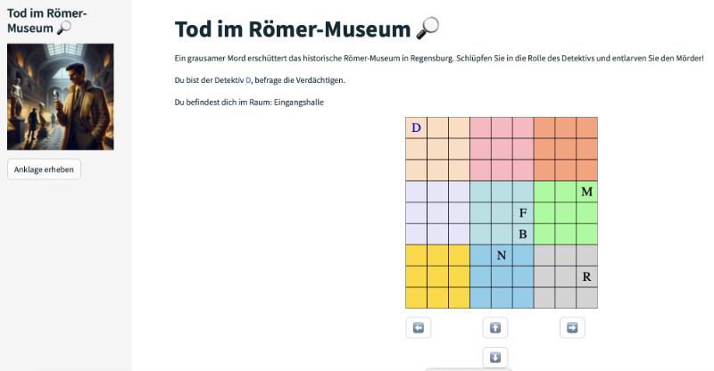
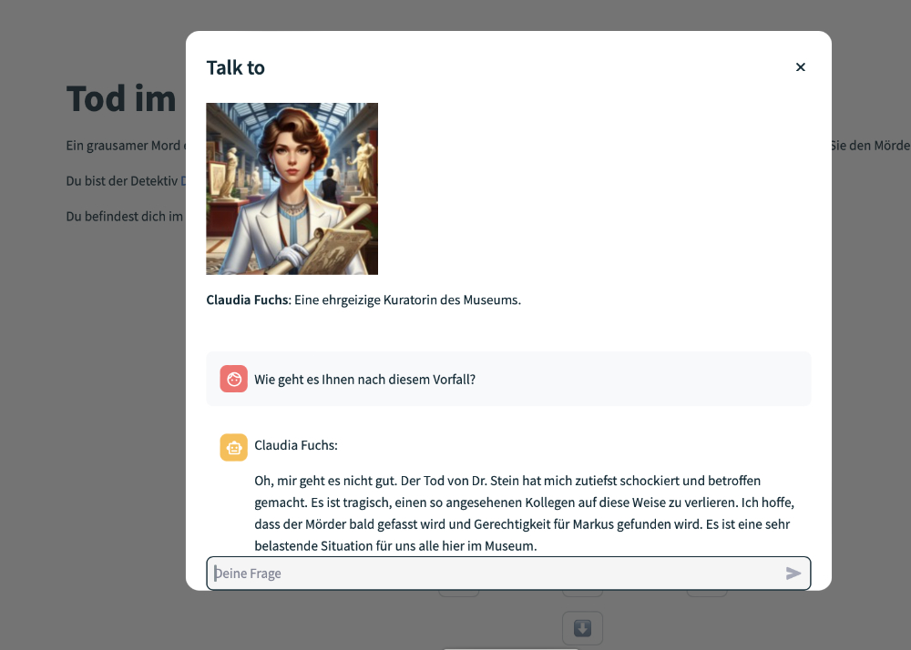

# cases - murder mystery game mit ChatGPT

<br><br><br><br><br><br><br><br><br><br><br><br><br><br>

Wer ist der Mörder. Du bist der Detektiv und befrägst die sechs Verdächtigen. Diese spielt ChatGPT.

<br><br><br><br><br><br><br><br><br><br><br><br><br><br>

Die Fälle hat ebenfalls ChatGPT generiert. Die Bilder hat Dall-e erstellt. Mit einer lokalen Kopie des Programmes kannst du dir von ChatGPT neue Fälle erzeugen lassen.

## Installation

### Ohne lokale Installation im Web spielen

Das Spiel Cases steht in der Streamlit Cloud frei zur Verfügung.

Einfach auf diesen Link https://cases-murder-mystery-game.streamlit.app klicken

### Lokale Installation

* Verzeichnis von GitHub auf Platte kopieren
* In das Verzeichnis wechseln
* Sicherstellen, dass alle Python-Module vorhanden sind **pip install -r requirements.txt**
* Starten der Anwendung mit **streamlit run app.py**


```Rust

```
